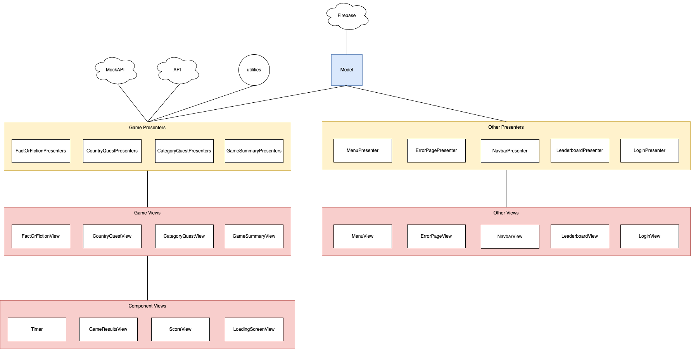

# Country Quiz

## Project Setup

### Prerequisites

- Node.js and npm installed on your system

### Installation

1. Clone the repository to your local machine.
2. Navigate to the project directory in your terminal.
3. Run `npm install` to install project dependencies.
4. After installation, you can run `npm start` to start the development server.

### Usage

- This project is a React application where you first need to create an account and login to get access to the rest of the application.
- You can play different game modes and view your scores in the leaderboard.

### Dependencies

- This project uses various third-party components from the Material-UI library.
- The Firebase library is used for real-time database interaction and authentication.
- The `react-timer-wrapper` library is used for handling timer functionalities.

## Project Description

The project is a fun and educational quiz of facts about countries. There are three game modes:

1. <b><u>Fact or Fiction</u></b>: Presents the user a fact and asks them to guess whether it is true or false
2. <b><u>Category Quest</u></b>: Users can input facts of countries for different categories
3. <b><u>Country Quest</u></b>: Presents a flag and asks the user to guess the corresponding country

Correct answers give the user points which allows them to climb up the leaderboard.

## Progress

We have implemented:

- The UI and logic for login and for creating an account.
- The navigation and the corresponding navbar
- A menu page where the user can choose between different game modes and see a leaderboard preview with real data from firebase
- A full leaderboard with real data from firebase
- The UI and the logic for all the three game modes, "Fact or Fiction", "countryQuest" and "categoryQuest"
  - This includes fetching the data from the API and the game mechanics as well as the final results page
- Responsiveness
- A consistent design pattern (color schemes, third party ui library etc.)

## High Level Architecture Overview



## Project File structure

### Project Tree

```bash
.
── package.json
├── src
│   ├── context
│   ├── provider
│   ├── contexts
│   │   └── authContext
│   │       └── index.tsx
│   ├── fetchProtection.ts
│   ├── globals.ts
│   ├── react-indicators.d.ts
│   ├── react-timer-wrapper.d.ts
│   ├── vite-env.d.ts
│   ├── AuthLayer.tsx
│   ├── auth.ts
│   ├── Root.tsx
│   ├── api
│   │   ├── apiConfig.ts
│   │   ├── apiSource.ts
│   │   ├── types.ts
│   │   └── mock
│   │       ├── mockApi.ts
│   │       └── data
│   │           ├── highscoreDataCategoryQuest.json
│   │           ├── highscoreDataCountryQuest.json
│   │           ├── highscoreDataFactOrFiction.json
│   │           └── mockCountryData.ts
│   ├── firebaseConfig.ts
│   ├── index.tsx
│   ├── model
│   │   ├── Model.ts
│   │   ├── helpers
│   │   │   ├── resolvePromise.ts
│   │   │   ├── countdownTimerViewHelpers.ts
│   │   │   ├── scoreViewHelper.ts
│   │   │   ├── categoryQuestHelper.ts
│   │   │   ├── countryQuestHelper.ts
│   │   │   ├── factOrFictionHelper.ts
│   │   │   ├── gameSummaryHelpers.ts
│   │   │   ├── progressBarHelper.ts
│   │   │   └── gameHelpers.ts
│   │   └── types
│   │       ├── leaderboardTypes.ts
│   │       ├── createAccountStateTypes.ts
│   │       ├── loginState.ts
│   │       ├── navbarTypes.ts
│   │       └── gameStateTypes.ts
│   ├── presenter
│   │   ├── errorPagePresenter.tsx
│   │   ├── navbarPresenter.tsx
│   │   ├── createAccountPresenter.tsx
│   │   ├── loginPresenter.tsx
│   │   ├── categoryQuestPresenter.tsx
│   │   ├── countryQuestPresenter.tsx
│   │   ├── factOrFictionPresenter.tsx
│   │   ├── fullLeaderboardPresenter.tsx
│   │   └── menuPresenter.tsx
│   └── views
│       ├── categoryQuestMenuView.tsx
│       ├── categoryQuestQuestionView.tsx
│       ├── countryQuestView.tsx
│       ├── factOrFictionView.tsx
│       ├── authentification
│       │   ├── createAccountView.tsx
│       │   └── loginView.tsx
│       ├── game
│       │   ├── countdownTimerView.tsx
│       │   ├── exitButton.tsx
│       │   ├── scoreView.tsx
│       │   ├── factCard.tsx
│       │   ├── gameLayout.tsx
│       │   ├── progressBarView.tsx
│       │   └── summary
│       │       ├── gameSummaryView.tsx
│       │       └── mobileGameSummaryTableRow.tsx
│       ├── leaderboard
│       │   ├── tabView.tsx
│       │   ├── fullLeaderboardView.tsx
│       │   ├── leaderboardItemView.tsx
│       │   └── podiumView.tsx
│       ├── menu
│       │   ├── menuButtonView.tsx
│       │   ├── menuView.tsx
│       │   └── leaderboardPreview.tsx
│       └── ui
│           ├── errorPageView.tsx
│           ├── loadingScreenView.tsx
│           └── navbarView.tsx
└── README.md
```

## Project Structure

### src

This is the main source directory for the project.

#### context

- Contains files related to context management in the application.

#### provider

- Contains files that provide context or other services to the components.

#### contexts/authContext

- Defines the authentication context and provider for managing user authentication state.

#### fetchProtection.ts

- Utility for handling fetch protection.

#### globals.ts

- Global constants and configurations used across the application.

#### react-indicators.d.ts, react-timer-wrapper.d.ts, vite-env.d.ts

- TypeScript declaration files for various modules.

#### AuthLayer.tsx

- Component responsible for providing an authentication layer to the application.

#### auth.ts

- Handles authentication logic.

#### Root.tsx

- The root component of the application, typically rendering the main application structure.

#### api

- Contains API configuration, sources, types, and mock data for testing.

  ##### apiConfig.ts

  - Configuration for API requests.

  ##### apiSource.ts

  - Source definitions for API endpoints.

  ##### types.ts

  - Type definitions for API responses.

  ##### mock

  - Mock implementations and data for testing without live API calls.

    ##### mockApi.ts

    - Mock API implementation.

    ##### data

    - Contains mock data files in JSON format.

      ###### highscoreDataCategoryQuest.json, highscoreDataCountryQuest.json, highscoreDataFactOrFiction.json

      - Mock data for different highscore categories.

      ####### mockCountryData.ts

      - Mock data for country-specific information.

#### firebaseConfig.ts

- Firebase configuration for the application.

#### index.tsx

- The main entry point for the React application.

#### model

- Contains the data models and related helpers for the application.

  ##### Model.ts

  - Main model file defining the data structure.

  ##### helpers

  - Utility functions for various parts of the application logic.

    ###### resolvePromise.ts, countdownTimerViewHelpers.ts, scoreViewHelper.ts, categoryQuestHelper.ts, countryQuestHelper.ts, factOrFictionHelper.ts, gameSummaryHelpers.ts, progressBarHelper.ts, gameHelpers.ts

    - Helper functions for specific features and views.

  ##### types

  - Type definitions for various states and components.

    ###### leaderboardTypes.ts, createAccountStateTypes.ts, loginState.ts, navbarTypes.ts, gameStateTypes.ts

    - Type definitions for leaderboard, account creation, login, navbar, and game states.

#### presenter

- Contains the presenter components responsible for connecting views with the model.

  ##### errorPagePresenter.tsx, navbarPresenter.tsx, createAccountPresenter.tsx, loginPresenter.tsx, categoryQuestPresenter.tsx, countryQuestPresenter.tsx, factOrFictionPresenter.tsx, fullLeaderboardPresenter.tsx, menuPresenter.tsx

  - Presenters for handling different parts of the application logic and UI updates.

#### views

- Contains the view components for rendering UI elements.

  ##### categoryQuestMenuView.tsx, categoryQuestQuestionView.tsx, countryQuestView.tsx, factOrFictionView.tsx

  - Views for different quiz and game modes.

  ##### authentification

  - Views related to user authentication.

    ###### createAccountView.tsx

    - View for the create account page.

    ###### loginView.tsx

    - View for the login page.

  ##### game

  - Views related to the game interface and components.

    ###### countdownTimerView.tsx, exitButton.tsx, scoreView.tsx, factCard.tsx, gameLayout.tsx, progressBarView.tsx

    ###### summary

    - Game summary views.

      ####### gameSummaryView.tsx, mobileGameSummaryTableRow.tsx

      - Views for displaying game summaries.

  ##### leaderboard

  - Views related to the leaderboard.

    ###### tabView.tsx, fullLeaderboardView.tsx, leaderboardItemView.tsx, podiumView.tsx

    - Views for displaying different parts of the leaderboard.

  ##### menu

  - Views related to the menu interface.

    ###### menuButtonView.tsx, menuView.tsx, leaderboardPreview.tsx

    - Views for the menu and leaderboard preview.

  ##### ui

  - General UI components.

    ###### errorPageView.tsx, loadingScreenView.tsx, navbarView.tsx

    - Views for error pages, loading screens, and the navigation bar.
